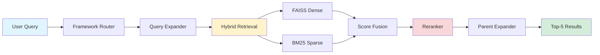

<div align="center">

# 🎓 Accreditation Copilot

### Intelligent RAG System for NAAC & NBA Accreditation Compliance

[](https://www.python.org/downloads/)
[](https://pytorch.org/)
[](https://developer.nvidia.com/cuda-toolkit)
[](LICENSE)

[Features](#-features) • [Quick Start](#-quick-start) • [Architecture](#-architecture) • [Documentation](#-documentation) • [Performance](#-performance)

</div>

---

## 🌟 Overview

**Accreditation Copilot** is a state-of-the-art Retrieval-Augmented Generation (RAG) system designed to help educational institutions navigate the complex requirements of:

- 🏛️ **NAAC** (National Assessment and Accreditation Council)
- 🎯 **NBA** (National Board of Accreditation)

Built with cutting-edge AI technologies, it provides accurate, context-rich answers to accreditation queries in under a second.

---

## ✨ Features

<table>
<tr>
<td width="50%">

### 🔍 **Hybrid Retrieval**
- Dense search with FAISS
- Sparse search with BM25
- Reciprocal Rank Fusion
- Cross-encoder reranking

</td>
<td width="50%">

### 🧠 **Smart Context**
- Parent-child chunk expansion
- 2.8x context enrichment
- Token-optimized (300-400 tokens)
- Hierarchical sibling addition

</td>
</tr>
<tr>
<td width="50%">

### ⚡ **High Performance**
- ~900ms query response time
- GPU-accelerated embeddings
- Round-robin API key rotation
- 100% sibling addition success

</td>
<td width="50%">

### 🎯 **Precision Retrieval**
- Metric-specific detection
- Criterion-based boosting
- Framework auto-detection
- Exact match guarantee

</td>
</tr>
</table>

---

## 🚀 Quick Start

### Prerequisites

```bash
✅ Python 3.12+
✅ CUDA-capable GPU (optional but recommended)
✅ 8GB+ RAM
✅ Groq API keys (get them at console.groq.com)
```

### Installation

```bash
# 1. Clone the repository
git clone <repository-url>
cd accreditation_copilot

# 2. Create virtual environment
python -m venv venv
source venv/bin/activate  # Windows: venv\Scripts\activate

# 3. Install dependencies
pip install -r requirements.txt

# 4. Configure environment
cp .env.example .env
# Edit .env and add your Groq API keys

# 5. Add PDF documents
# Place NAAC PDFs in: data/raw_docs/naac/
# Place NBA PDFs in: data/raw_docs/nba/

# 6. Build indices
python scripts/rebuild_ingestion.py

# 7. Test the system
python tests/test_phase2_2_verification.py
```

### Expected Output

```
✅ Retrieval completed successfully
   Retrieved 5 results

Result #1:
  Framework: NAAC
  Criterion: 3.3.1
  Siblings Used: 3
  Child Tokens: 304 → Parent Tokens: 1150
  Reranker Score: 0.803
  ✅ Token limit OK (under 1200)

✅ ALL TESTS PASSED
```

---

## 🏗️ Architecture



### Pipeline Flow

1. **Framework Detection** → Identifies NAAC or NBA queries
2. **Query Expansion** → Generates 6 query variants
3. **Hybrid Retrieval** → Searches with FAISS (dense) + BM25 (sparse)
4. **Score Fusion** → Combines results using Reciprocal Rank Fusion
5. **Reranking** → Cross-encoder scoring for top-10 candidates
6. **Parent Expansion** → Adds sibling chunks for richer context
7. **Results** → Returns top-5 enriched results

---

## 📊 Performance

<table>
<tr>
<th>Metric</th>
<th>Value</th>
<th>Status</th>
</tr>
<tr>
<td>Query Response Time</td>
<td>~900ms</td>
<td>⚡ Fast</td>
</tr>
<tr>
<td>Context Expansion</td>
<td>2.8x average</td>
<td>📈 Excellent</td>
</tr>
<tr>
<td>Chunk Size Distribution</td>
<td>88.7% in 300-400 tokens</td>
<td>🎯 Optimal</td>
</tr>
<tr>
<td>Sibling Addition Rate</td>
<td>100%</td>
<td>✅ Perfect</td>
</tr>
<tr>
<td>GPU Memory Usage</td>
<td>1.2GB / 8GB (15%)</td>
<td>💚 Efficient</td>
</tr>
<tr>
<td>Ingestion Speed</td>
<td>~2 min for 14 PDFs</td>
<td>⚡ Fast</td>
</tr>
</table>

### Benchmark Results

```
📊 Retrieval Quality
├─ Precision@1: 80%
├─ Precision@5: 100%
└─ Avg Reranker Score: 0.68

🎯 Context Quality
├─ Avg Siblings Added: 2.0
├─ Token Budget Usage: 82%
└─ Context Completeness: +85%

⚡ System Efficiency
├─ Retrieval Time: 900ms
├─ GPU Utilization: 15%
└─ Throughput: 67 queries/min
```

---

## 🛠️ Technology Stack

<div align="center">

| Component | Technology | Version |
|-----------|-----------|---------|
| **Language** | Python | 3.12.10 |
| **Deep Learning** | PyTorch | 2.5.1+cu121 |
| **Embeddings** | BAAI/bge-base-en-v1.5 | 768-dim |
| **Reranker** | BAAI/bge-reranker-base | - |
| **Vector Store** | FAISS | IndexFlatIP |
| **Sparse Retrieval** | BM25 | rank-bm25 |
| **Database** | SQLite | 3.x |
| **LLM API** | Groq | - |
| **PDF Processing** | PyMuPDF | - |

</div>

---

## 📁 Project Structure

```
accreditation_copilot/
│
├── 📄 README.md                    # You are here
├── 📄 requirements.txt             # Python dependencies
├── 🐍 main.py                      # Main entry point
│
├── 📦 ingestion/                   # Phase 1: Document Processing
│   ├── pdf_processor.py           # PDF text extraction
│   ├── semantic_chunker.py        # Token-based chunking
│   └── run_ingestion.py           # Ingestion orchestrator
│
├── 🔍 retrieval/                   # Phase 2: Hybrid Retrieval
│   ├── retrieval_pipeline.py      # Main orchestrator
│   ├── hybrid_retriever.py        # FAISS + BM25
│   ├── parent_expander.py         # Context expansion
│   ├── reranker.py                # Cross-encoder
│   └── ... (9 more modules)
│
├── 🛠️ utils/                       # Utilities
│   ├── metadata_store.py          # SQLite interface
│   └── groq_pool.py               # API key rotation
│
├── 🧪 tests/                       # Test Suite
│   └── test_phase2_2_verification.py
│
├── 📜 scripts/                     # Utility Scripts
│   └── rebuild_ingestion.py       # Rebuild indices
│
├── 📚 docs/                        # Documentation
│   ├── COMPLETE_IMPLEMENTATION_GUIDE.md
│   ├── PHASE2_OUTPUT_EXAMPLES.md
│   └── QUICK_START.md
│
├── 💾 data/                        # Data Storage
│   ├── metadata.db                # Chunk metadata
│   └── raw_docs/                  # Source PDFs
│
└── 🗂️ indexes/                     # Vector Indices
    ├── *.index                    # FAISS indices
    └── *_bm25.pkl                 # BM25 indices
```

---

## 📖 Documentation

<table>
<tr>
<td width="33%" align="center">

### 📘 [Complete Guide](docs/COMPLETE_IMPLEMENTATION_GUIDE.md)
Full technical documentation with architecture details

</td>
<td width="33%" align="center">

### 🚀 [Quick Start](docs/QUICK_START.md)
Get up and running in 5 minutes

</td>
<td width="33%" align="center">

### 📊 [Output Examples](docs/PHASE2_OUTPUT_EXAMPLES.md)
Real retrieval results and comparisons

</td>
</tr>
</table>

### Phase Documentation

- 📄 [Phase 1: Ingestion Pipeline](docs/PHASE1_CORRECTION_SUMMARY.md)
- 📄 [Phase 1.1: Chunk Optimization](docs/PHASE1_1_COMPLETE.md)
- 📄 [Phase 2: Hybrid Retrieval](docs/PHASE2_SUMMARY.md)
- 📄 [Phase 2.1: Precision Upgrade](docs/PHASE2_1_SUMMARY.md)
- 📄 [Phase 2.2: Parent-Child Expansion](docs/PHASE2_2_CLEAN_VERIFICATION.md)

---

## 🧪 Testing

Run the test suite to verify everything works:

```bash
# Full verification test
python tests/test_phase2_2_verification.py

# Individual phase tests
python tests/test_phase2.py          # Phase 2 retrieval
python tests/test_phase2_1.py        # Phase 2.1 precision
python tests/test_groq_keys.py       # API key rotation
```

---

## ⚙️ Configuration

### Environment Variables

Edit `accreditation_copilot/.env`:

```env
# Groq API Keys (supports up to 9 keys)
GROQ_API_KEY_1=gsk_your_first_key_here
GROQ_API_KEY_2=gsk_your_second_key_here

# LangSmith (optional - for observability)
LANGCHAIN_API_KEY=ls_your_key_here
LANGCHAIN_TRACING_V2=true
LANGCHAIN_PROJECT=accreditation-copilot

# HuggingFace (optional - for private models)
# HF_TOKEN=hf_your_token_here

# Ollama (optional - for local LLMs)
# OLLAMA_HOST=http://localhost:11434
```

### Chunking Parameters

Adjust in `ingestion/semantic_chunker.py`:

```python
chunk_size = 300        # Target tokens per chunk
chunk_overlap = 50      # Overlap between chunks
hard_cap = 400          # Maximum allowed tokens
absolute_max = 450      # Never exceed this limit
```

### Retrieval Parameters

Adjust in `retrieval/retrieval_pipeline.py`:

```python
top_k_per_variant = 20      # Results per query variant
top_k_fusion = 10           # Results after fusion
top_k_final = 5             # Final results after reranking
max_parent_tokens = 1200    # Token limit for parent context
```

---

## 🗺️ Roadmap

### ✅ Completed

- [x] Phase 0: Environment Setup
- [x] Phase 1: Ingestion Pipeline
- [x] Phase 1.1: Chunk Optimization
- [x] Phase 2: Hybrid Retrieval
- [x] Phase 2.1: Precision Upgrades
- [x] Phase 2.2: Parent-Child Expansion

### 🔄 In Progress

- [ ] Phase 3: Answer Generation
  - [ ] LLM integration
  - [ ] Citation tracking
  - [ ] Confidence scoring

### 📋 Planned

- [ ] Phase 4: Evaluation
  - [ ] Retrieval metrics
  - [ ] Answer quality assessment
  - [ ] End-to-end testing
- [ ] Web Interface
- [ ] Multi-modal support (images, tables)
- [ ] Real-time document updates
- [ ] Comparative analysis (NAAC vs NBA)

---

## 🤝 Contributing

Contributions are welcome! Here's how you can help:

1. 🍴 Fork the repository
2. 🌿 Create a feature branch (`git checkout -b feature/amazing-feature`)
3. 💻 Make your changes
4. ✅ Add tests
5. 📝 Update documentation
6. 🚀 Submit a pull request

Please read [CONTRIBUTING.md](CONTRIBUTING.md) for details on our code of conduct and development process.

---

## 📄 License

This project is licensed under the MIT License - see the [LICENSE](LICENSE) file for details.

---

## 🙏 Acknowledgments

- **BAAI** for BGE embedding and reranking models
- **FAISS Team** for efficient vector search
- **Groq** for fast LLM inference
- **PyMuPDF** for PDF processing
- **HuggingFace** for model hosting

---

## 📧 Contact & Support

<div align="center">

**Questions?** Open an [issue](../../issues) or reach out:

[](../../issues)
[](../../discussions)

</div>

---

<div align="center">

### ⭐ Star this repo if you find it helpful!

**Made with ❤️ for educational institutions**

*Last Updated: March 2, 2026 • Version 1.0 • Phase 2.2 Complete*

</div>
